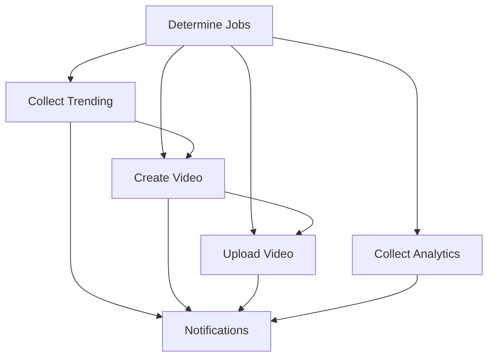

# 🚀 CI/CD Video Pipeline Matrix Setup

This document explains how to set up and use the comprehensive CI/CD system for the automated video generation pipeline.

## 📋 Overview

The system provides a matrix-based workflow orchestration with the following components:

### 🎯 Workflow Matrix Jobs:
- **`collect_trending`** (hourly) - Collects YouTube trending data
- **`create_video`** (on new script) - Generates video content from trending data
- **`upload_video`** (after build) - Uploads videos to YouTube
- **`collect_analytics`** (daily) - Collects YouTube Analytics data

### 🔧 Reusable Components:
- **Setup Workflow** - Python environment with dependency caching
- **Notification Workflow** - Slack/Discord webhook alerts

## 🏗️ Setup Instructions

### 1. Repository Secrets Configuration

Add the following secrets to your GitHub repository (`Settings → Secrets and Variables → Actions`):

#### YouTube API Keys:
```
YOUTUBE_API_KEY_1=your_first_api_key
YOUTUBE_API_KEY_2=your_second_api_key
YOUTUBE_API_KEY_3=your_third_api_key
```

#### Google OAuth Credentials:
```
GOOGLE_OAUTH_CREDENTIALS={"installed":{"client_id":"...","client_secret":"...",...}}
GOOGLE_REFRESH_TOKEN={"refresh_token":"...","token_uri":"https://oauth2.googleapis.com/token",...}
```

#### OpenAI API Key:
```
OPENAI_API_KEY=sk-...your_openai_key
```

#### Webhook URLs (Optional):
```
SLACK_WEBHOOK_URL=https://hooks.slack.com/services/...
DISCORD_WEBHOOK_URL=https://discord.com/api/webhooks/...
```

### 2. Repository Variables Configuration

Add these variables (`Settings → Secrets and Variables → Actions → Variables`):

```
CLOUDFLARE_R2_ENABLED=false
CLOUDFLARE_R2_BUCKET=your-bucket-name
CLOUDFLARE_R2_ENDPOINT=https://your-account.r2.cloudflarestorage.com
```

### 3. Required Dependencies

Ensure your `requirements-core.txt` includes:

```txt
# Core dependencies
pandas>=2.0.0
numpy>=1.24.0
requests>=2.28.0
openai>=1.0.0
pydantic>=2.0.0
sqlalchemy>=2.0.0
sqlmodel>=0.0.14

# Google APIs
google-api-python-client>=2.100.0
google-auth>=2.20.0
google-auth-oauthlib>=1.0.0
google-auth-httplib2>=0.2.0

# Additional
aiofiles>=24.0.0
httpx>=0.28.0
python-dotenv>=1.0.0
PyYAML>=6.0.0
```

## 🎮 Usage Guide

### Manual Triggering

#### Full Pipeline Execution:
```bash
# Via GitHub UI: Actions → Video Pipeline Matrix → Run workflow
# Select: "full_pipeline"
```

#### Individual Components:
```bash
# Collect trending data only
operation: "collect_trending"
regions: "US,GB,CA,AU"

# Create video content only  
operation: "create_video"
video_topic: "AI Technology Trends"

# Upload videos only
operation: "upload_video"
dry_run: false

# Collect analytics only
operation: "collect_analytics"
```

### Automated Scheduling

The system runs automatically on these schedules:

- **Hourly** (15 minutes past each hour): Trending data collection
- **Daily** (2:00 AM UTC): Analytics collection
- **On push** to `data/scripts/**` or `generated_videos/**`: Video upload
- **On workflow completion**: Video creation after successful trending collection

### 🔄 Workflow Dependencies



## 📊 Monitoring & Alerts

### Slack Integration

The system sends detailed Slack notifications with:

- **Workflow status** (success/failure/cancelled)
- **Repository and branch information**
- **Run details and links**
- **Job-specific results**

#### Sample Slack Message:
```
✅ Video Pipeline Matrix - Success

📂 Repository: username/omnisphere
🌿 Branch: main  
🔢 Run: #42
👤 Actor: github-actions

📋 Details:
Pipeline ID: pipeline-20241201-143052-42
Trending: success
Video Creation: success  
Upload: success
Analytics: skipped
```

### Discord Integration

Similar rich embed notifications are available for Discord channels.

### GitHub Actions Dashboard

Each workflow provides detailed summaries with:
- Step-by-step execution logs
- Artifact uploads (databases, logs, reports)
- Performance metrics
- Error details and retry information

## 🧪 Testing & Development

### Dry Run Mode

Test the pipeline without actual uploads:

```bash
operation: "upload_video"
dry_run: true
```

### Local Development

1. **Clone repository**:
   ```bash
   git clone https://github.com/yourusername/omnisphere.git
   cd omnisphere
   ```

2. **Install dependencies**:
   ```bash
   pip install -r requirements-core.txt
   ```

3. **Set environment variables**:
   ```bash
   cp .env.example .env
   # Edit .env with your API keys
   ```

4. **Test individual components**:
   ```bash
   python collect_trending.py
   python generate_script.py
   python build_video.py
   python analytics_collector.py
   ```

## 🔧 Configuration Options

### Python Environment

- **Version**: 3.10 (configurable)
- **Cache**: Pip dependencies cached automatically
- **Timeout**: 30 minutes for video creation, 45 minutes for uploads

### Artifact Retention

- **Video content**: 7 days
- **Databases and logs**: 30 days
- **Analytics reports**: 30 days

### Concurrency Control

- **Trending collection**: No concurrent runs
- **YouTube uploads**: No concurrent runs  
- **Video pipeline**: No concurrent runs per branch

## 🚨 Troubleshooting

### Common Issues

#### 1. API Quota Exceeded
**Solution**: Add multiple YouTube API keys for automatic rotation

#### 2. Upload Failures
**Solution**: Check OAuth credentials and refresh tokens

#### 3. Missing Dependencies
**Solution**: Update `requirements-core.txt` and clear pip cache

#### 4. Webhook Failures
**Solution**: Verify webhook URLs in repository secrets

### Debug Information

Enable debug logging by setting:
```yaml
env:
  DEBUG: true
  VERBOSE_LOGGING: true
```

### Logs Location

- **GitHub Actions**: Available in workflow run details
- **Artifacts**: Downloaded from workflow artifacts
- **Local**: `trending_collector.log`, `script_generator.log`, etc.

## 📈 Performance Optimization

### Caching Strategy

1. **Pip dependencies**: Cached using actions/cache
2. **API responses**: Cached in SQLite databases
3. **Generated content**: Stored as artifacts

### Resource Limits

- **Memory**: 7GB (GitHub Actions standard)
- **CPU**: 2-core (GitHub Actions standard)  
- **Storage**: 14GB (GitHub Actions standard)
- **Network**: No specific limits

### Scaling Considerations

For high-volume usage, consider:

1. **Self-hosted runners** for more resources
2. **Multiple API keys** for higher quotas
3. **Database optimization** for large datasets
4. **Cloud storage integration** (R2, S3) for artifacts

## 🔒 Security Best Practices

1. **API Keys**: Use repository secrets, never commit to code
2. **Tokens**: Rotate OAuth tokens regularly
3. **Webhooks**: Use HTTPS URLs only
4. **Permissions**: Limit repository access to necessary users
5. **Monitoring**: Enable security alerts for the repository

## 📚 Additional Resources

- [GitHub Actions Documentation](https://docs.github.com/en/actions)
- [YouTube Data API Documentation](https://developers.google.com/youtube/v3)
- [OpenAI API Documentation](https://platform.openai.com/docs)
- [Slack Webhook Documentation](https://api.slack.com/messaging/webhooks)
- [Discord Webhook Documentation](https://discord.com/developers/docs/resources/webhook)

## 💬 Support

For issues or questions:

1. **Check workflow logs** in GitHub Actions
2. **Review error messages** in step summaries  
3. **Verify configuration** against this documentation
4. **Test individual components** locally
5. **Open an issue** on the repository

---

*Last updated: December 2024*
